# Execution Plan

## Detailed Analysis Summary

### Change Impact Assessment
- **User-facing changes**: Yes — entirely new conversational AI chatbot, clerk dashboard, admin dashboard, and public display
- **Structural changes**: Yes — greenfield multi-tenant serverless platform with 6+ subsystems
- **Data model changes**: Yes — new DynamoDB data model for tenants, locations, clerks, customers, appointments, queues, transactions, pre-screening
- **API changes**: Yes — new REST API surface covering chatbot, admin, clerk, scheduling, notifications, display
- **NFR impact**: Yes — security baseline (15 rules), multi-tenancy, data retention, real-time queue updates

### Risk Assessment
- **Risk Level**: Medium-High
- **Rationale**: Large greenfield scope (68+ functional requirements, 46 user stories, 6 subsystems), government PII handling, multi-tenant architecture, real-time queue management, external integrations (Twilio, Bedrock)
- **Rollback Complexity**: Low (greenfield — no existing system to break)
- **Testing Complexity**: Complex (multi-subsystem integration, Bedrock AI, Twilio SMS/email)

## Workflow Visualization

```mermaid
flowchart TD
    Start(["User Request"])

    subgraph INCEPTION["INCEPTION PHASE"]
        WD["Workspace Detection<br/>COMPLETED"]
        RA["Requirements Analysis<br/>COMPLETED"]
        US["User Stories<br/>COMPLETED"]
        WP["Workflow Planning<br/>IN PROGRESS"]
        AD["Application Design<br/>EXECUTE"]
        UG["Units Generation<br/>EXECUTE"]
    end

    subgraph CONSTRUCTION["CONSTRUCTION PHASE"]
        FD["Functional Design<br/>EXECUTE per unit"]
        NFRA["NFR Requirements<br/>EXECUTE per unit"]
        NFRD["NFR Design<br/>EXECUTE per unit"]
        ID["Infrastructure Design<br/>EXECUTE per unit"]
        CG["Code Generation<br/>EXECUTE per unit"]
        BT["Build and Test<br/>EXECUTE"]
    end

    subgraph OPERATIONS["OPERATIONS PHASE"]
        OPS["Operations<br/>PLACEHOLDER"]
    end

    Start --> WD
    WD --> RA
    RA --> US
    US --> WP
    WP --> AD
    AD --> UG
    UG --> FD
    FD --> NFRA
    NFRA --> NFRD
    NFRD --> ID
    ID --> CG
    CG -.->|Next Unit| FD
    CG --> BT
    BT -.-> OPS
    BT --> End(["Complete"])

    style WD fill:#4CAF50,stroke:#1B5E20,stroke-width:3px,color:#fff
    style RA fill:#4CAF50,stroke:#1B5E20,stroke-width:3px,color:#fff
    style US fill:#4CAF50,stroke:#1B5E20,stroke-width:3px,color:#fff
    style WP fill:#4CAF50,stroke:#1B5E20,stroke-width:3px,color:#fff
    style AD fill:#FFA726,stroke:#E65100,stroke-width:3px,stroke-dasharray: 5 5,color:#000
    style UG fill:#FFA726,stroke:#E65100,stroke-width:3px,stroke-dasharray: 5 5,color:#000
    style FD fill:#FFA726,stroke:#E65100,stroke-width:3px,stroke-dasharray: 5 5,color:#000
    style NFRA fill:#FFA726,stroke:#E65100,stroke-width:3px,stroke-dasharray: 5 5,color:#000
    style NFRD fill:#FFA726,stroke:#E65100,stroke-width:3px,stroke-dasharray: 5 5,color:#000
    style ID fill:#FFA726,stroke:#E65100,stroke-width:3px,stroke-dasharray: 5 5,color:#000
    style CG fill:#4CAF50,stroke:#1B5E20,stroke-width:3px,color:#fff
    style BT fill:#4CAF50,stroke:#1B5E20,stroke-width:3px,color:#fff
    style OPS fill:#BDBDBD,stroke:#424242,stroke-width:2px,stroke-dasharray: 5 5,color:#000
    style Start fill:#CE93D8,stroke:#6A1B9A,stroke-width:3px,color:#000
    style End fill:#CE93D8,stroke:#6A1B9A,stroke-width:3px,color:#000
    style INCEPTION fill:#BBDEFB,stroke:#1565C0,stroke-width:3px,color:#000
    style CONSTRUCTION fill:#C8E6C9,stroke:#2E7D32,stroke-width:3px,color:#000
    style OPERATIONS fill:#FFF59D,stroke:#F57F17,stroke-width:3px,color:#000

    linkStyle default stroke:#333,stroke-width:2px
```



### Text Alternative
```
Phase 1: INCEPTION
  - Workspace Detection (COMPLETED)
  - Requirements Analysis (COMPLETED)
  - User Stories (COMPLETED)
  - Workflow Planning (IN PROGRESS)
  - Application Design (EXECUTE)
  - Units Generation (EXECUTE)

Phase 2: CONSTRUCTION (per unit)
  - Functional Design (EXECUTE)
  - NFR Requirements (EXECUTE)
  - NFR Design (EXECUTE)
  - Infrastructure Design (EXECUTE)
  - Code Generation (EXECUTE)
  - Build and Test (EXECUTE)

Phase 3: OPERATIONS
  - Operations (PLACEHOLDER)
```

## Phases to Execute

### INCEPTION PHASE
- [x] Workspace Detection (COMPLETED) — Greenfield confirmed
- [x] Reverse Engineering (SKIPPED) — Greenfield, no existing code
- [x] Requirements Analysis (COMPLETED) — Comprehensive depth, 68+ requirements, approved
- [x] User Stories (COMPLETED) — 46 stories, 24 epics, 4 personas, approved
- [x] Workflow Planning (IN PROGRESS)
- [ ] Application Design — EXECUTE
  - **Rationale**: Greenfield platform with 6+ subsystems (chatbot, admin dashboard, clerk dashboard, scheduling engine, notification service, public display). Component boundaries, service layer design, and inter-component dependencies must be defined before decomposition into units.
- [ ] Units Generation — EXECUTE
  - **Rationale**: System requires decomposition into multiple units of work. 6 subsystems with shared infrastructure (auth, multi-tenancy, data layer) need structured breakdown for incremental construction.

### CONSTRUCTION PHASE (per unit)
- [ ] Functional Design — EXECUTE
  - **Rationale**: New data models (DynamoDB tables for tenants, locations, clerks, customers, appointments, queues, transactions, pre-screening), complex business logic (scheduling engine, queue management with 3 queue types, prompt-switching AI), and business rules (capacity run-rate, skill matching, duration monitoring) all require detailed design.
- [ ] NFR Requirements — EXECUTE
  - **Rationale**: Security baseline (15 SECURITY rules enforced), multi-tenancy isolation, data retention policies (3yr general / 30d PII), real-time performance (2s queue updates), rate limiting on public endpoints. Government PII handling demands explicit NFR specification.
- [ ] NFR Design — EXECUTE
  - **Rationale**: NFR Requirements will execute, so NFR patterns (encryption, tenant isolation, rate limiting, data lifecycle) need to be incorporated into the design.
- [ ] Infrastructure Design — EXECUTE
  - **Rationale**: Full AWS serverless stack needs specification: Lambda, API Gateway, DynamoDB, S3, Cognito, Bedrock, CloudWatch. Plus external integrations (Twilio). Multi-tenant deployment architecture required.
- [ ] Code Generation — EXECUTE (ALWAYS)
  - **Rationale**: Implementation of all designed components.
- [ ] Build and Test — EXECUTE (ALWAYS)
  - **Rationale**: Build, test, and verification of all units.

### OPERATIONS PHASE
- [ ] Operations — PLACEHOLDER
  - **Rationale**: Future deployment and monitoring workflows

## Success Criteria
- **Primary Goal**: Deliver a working MVP for St. Lucie County with conversational AI chatbot, admin dashboard, clerk dashboard, scheduling engine, and public display
- **Key Deliverables**:
  - Conversational AI chatbot (standalone web app) with Bedrock integration
  - Admin dashboard (locations, clerks, transactions, scheduling config, duration monitoring)
  - Service clerk dashboard (check-in mode + service mode with queue management)
  - Dynamic scheduling/appointment engine
  - Public queue display
  - SMS/email notifications via Twilio
  - Multi-tenant data architecture (St. Lucie deployed, 67-county ready)
- **Quality Gates**:
  - All 15 SECURITY rules pass compliance
  - Tenant data isolation verified
  - PII not present in application logs
  - All public endpoints rate-limited
  - Encryption at rest and in transit on all data stores
