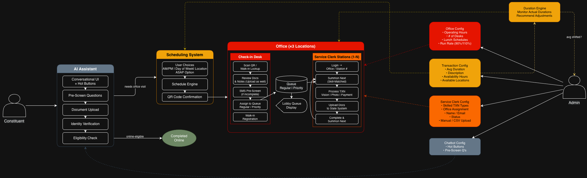

# 1 Executive Summary

This document describes the design of the St. Lucie County AI-Powered Tax System, a POC the CIC is developing with the St. Lucie County Tax Collector's office. The system has a couple of key goals: replace the current website with a conversational AI interface, reduce wasted office visits, dynamically schedule appointments based on transaction complexity, and get customers in and out as fast as possible. This codebase will be well-architected and extensible for an implementation partner to bring to production.

The county manages high-volume in-person appointments across 3 office locations for driver licenses, vehicle/vessel registrations, and other citizen services. Performance is strong, with most customers are served within 20 minutes, but there are some problems. Citizens walk through the door every day missing documents, carrying expired IDs, or completely unaware of the prerequisites for their transaction. An out-of-state resident moving to Florida may need to transfer a vehicle title, clear a lien, get a new driver license, and renew registrations, but they show up expecting to handle just one. When they're turned away, they come back another day, potentially having to take more time off work and stacking more volume on the county. The call center currently has roughly 100 lien transfer applications sitting in a backlog waiting on out-of-state lien holders, a process that could be kicked off automatically before the customer ever walks in.

The appointment system makes it worse. Scheduling today works like making a dinner reservation, every customer gets the same static 15–20 minute block regardless of what they need. There's no way to account for transaction complexity, clerk skill sets, or real-time office capacity.

We will work from the pain points derived from the discovery meeting and the prototype the county provided. The Tax Collector proposed a multi-service approach: an AI assistant, an admin dashboard, a check-in dashboard, a service clerk dashboard, and a customer display.

# 2 Proposal

We're building this PoC from scratch using the following tech stack: TypeScript for the backend and Next.js for the frontend. We will use AWS for both AI and infrastructure, with CDK for deployment. The county's Cursor prototype gives us the UX and workflow. Our job is to re-architect it as a clean, production-ready codebase a partner can take forward.

The system has five surfaces, matching what the county proposed. 
1. The AI assistant is the citizen-facing chatbot that replaces the website. handles transaction identification, document upload, identity verification, pre-screening questions, eligibility checks, and appointment booking. 
2. The admin dashboard where supervisors configure locations, transaction types, clerk skills, and capacity. 
3. The check-in dashboard is for front-desk clerks to scan QR codes, review documents, send SMS pre-screening, and assign customers to the queue. 
4. The service clerk dashboard is where clerks summon customers, view pre-loaded records, and process transactions. 
5. The customer display is a lobby screen showing queue numbers and station assignments.

## 2.1 Supporting Data

Some key metrics from the discovery meeting that validate the approach:
- Most customers are served within 20 minutes of their appointment time today.
- 100 lien transfer applications sitting in the call center backlog, waiting on out-of-state lien holders to respond.
- 1 hour saved per clerk per day is the efficiency target. Across 24 clerks and 3 offices, that's 72 hours/day, equivalent to 9 FTEs. The county plans to use that savings to slow onboarding and redirect staff to knowledge work, not layoffs.
- 6 Florida counties (400K+ residents each) have expressed interest in adopting the solution. The architecture should be built with possible expansion to all 67 counties.

## 2.2 User Stories

User stories can be a way to share customer data. They can also be a way to express requirements.

Users:
- Constituent: Citizens who reside in or are moving to St Lucie County, who likely need to DMV related services.
- Clerk: Front desk employees with differential skillsets that serve the people of St Lucie County. There are two distinct roles:
  - Check-in Clerk: Staffs the front desk, checks customers in, reviews documents, sends pre-screening questions, attaches notes, and assigns customers to the queue.
  - Service Clerk: Staffs a service station, summons customers from the queue, processes transactions (vision test, photo, payment), and uploads documents to the state system.
- Admin: Tax Collector who oversees County offices, managing clerks, scheduling, etc.

### Constituent Stories

As a constituent, I want to be able to describe what my situation is, and get it resolved without having to step foot into a county office.

As a constituent, I want to be walked through exactly which documents I need for my specific situation (out-of-state move, title transfer with lien, etc) so that I don't show up to the office missing something and have to come back another day taking more time off work.

As a constituent, I want to verify my identity online and upload my documents ahead of time so that when I arrive at the office, the clerk already has everything and I can get in and out.

As a constituent, I want to answer the required pre-screening questions through the chat before my appointment so I don't waste time filling them out at the counter.

As a constituent, I want the system to tell me if my transaction can be completed entirely online (simple registration renewal) so I can skip the office visit altogether and pay right then.

As a constituent, I want to receive a QR code confirmation after booking so I can check in quickly when I arrive at the office, and know that my appointment was booked.

### Check-in Clerk Stories

As a check-in clerk, I want to scan a customer's QR code or look them up by name so I can quickly pull up their record and check them in.

As a check-in clerk, I want to review the documents a customer uploaded through the AI assistant so I can confirm everything is in order before they enter the queue.

As a check-in clerk, I want to send incomplete customers their remaining pre-screening questions via SMS so they can finish in the lobby without holding up the line.

As a check-in clerk, I want to attach notes to a customer's record (special circumstances, repeat visitor context) so the service clerk has that information when they summon the customer.

As a check-in clerk, I want to assign a customer to the regular queue, priority queue (govt official/important person)

As a check-in clerk, I want to handle walk-in customers who haven't used the AI assistant by scanning them into the system and starting their record at the desk.

### Service Clerk Stories

As a service clerk, I want to log into my station each day, select my current office and seat number, and toggle my availability so the queue system does not route customers to me when I'm busy.

As a service clerk, I want the system to automatically assign the next customer to me based on my skill set so I serve customers I'm qualified to help.

As a service clerk, I want to see all of a customer's pre-uploaded documents, pre-screen answers, verified identity, and check-in clerk notes when I summon them so I can begin processing immediately.

As a service clerk, I want to process the transaction (vision test, photo, payment) and upload the customer's documents to the state system so the appointment is completed end-to-end at my station.

As a service clerk, I want to send a customer for their written test when required so they can complete that step on their own.

As a service clerk, I want a "complete and summon next" action so I can finish one customer and immediately pull the next one without extra steps.

### Admin Stories

As an admin, I want to configure each office location with its operating hours, number of seats, lunch schedules, and target capacity run rate so the scheduling system accurately reflects real-world availability.

As an admin, I want to define transaction types with descriptions, average durations, eligible service hours, and available locations so we can accurately estimate appointment length and schedule customers to the right office.

As an admin, I want to create clerk profiles (name, email, with optional bulk CSV upload), assign them to eligible office locations, select which transaction types they're skilled to perform, and set their status (active, in training, inactive) so the queue system only routes transactions to qualified, available clerks. The clerk then selects their actual office and station at daily login.

As an admin, I want the system to monitor actual transaction durations and recommend adjustments to the estimated times (transaction now averages 15 min instead of 20), alerting me and asking for approval so that the time does not drift automatically in special situations.

As an admin, I want to set a capacity run rate per office (90% to allow walk-ins, or 110% to overbook) so I can balance appointment density against walk-in traffic and no-show rates per location.

As an admin, I want to create and manage suggested prompt shortcuts (hot buttons) for the public-facing chat so constituents see the most common transactions up front without being overwhelmed by options.

## 2.3 Architecture

## 2.3.1 Database Design / Access Patterns

[Database Design](database-design.md) | [Data Access Patterns](data-access-patterns.md)

# 3 System Requirements

## 3.1 Functional Requirements

### 3.1.1 AI Assistant

These features comprise the citizen-facing experience accessible via web. The AI should minimize customer decisions, front-load preparation, and eliminate unnecessary steps at the service counter.

- Natural Language AI chatbot interface replacing traditional button-based website navigation. Must handle varied phrasing and intent recognition.
- Answer questions based on tcslc.com content using a knowledge base of web content.
- Document pre-check must occur before identity verification to avoid unnecessary cost.
- Document Upload where Customers scan and upload required documents before their appointment to prevent return visits. AI validates whether uploaded documents are acceptable for the transaction. Bypass option available for less tech-savvy users.
- Collects eligibility and HIPAA-related information pre-screen info prior to visit. Driver license transactions require 12 qualifying questions.
- Dynamic appointment scheduling with time slots allocated based on transaction complexity. Customers select morning/afternoon preference, day of week, and office location only. "As soon as possible" option available.
- System identifies whether the customer's transaction can be completed online and redirects them to self-service (MyEasyGov payment page) when applicable.
- Multi-Transaction Detection detects when a customer needs multiple services (e.g., driver license renewal + vehicle registration + title transfer) and bundles them into a single appointment with accurate combined duration.
- QR Code Check-In. Customers receive a QR code for appointment confirmation and use it to check in upon arrival, triggering record pre-population in the clerk queue.
- SMS / Text notifications throughout the process: appointment confirmation, reminders, check-in confirmation, queue summoning (both SMS and lobby display), and status updates. Use Email for PoC Scope.

### 3.1.2 Schedule Engine

The scheduling engine is a core technical component that calculates real-time appointment slot availability by considering multiple concurrent variables:

- Transaction type and estimated duration (using configurable estimates to start)
- Individual clerk skills and current availability
- Office capacity, configurable run-rate settings to accommodate walk-in traffic (90% to reserve slots, 110% to overbook)
- Lunch schedules (reduce capacity by x% for every person activley at lunch)
- Multi-office support with distinct schedules per location (e.g., 6-day/8am–6pm vs. 5-day/9am–5pm)

### 3.1.3 Check-in Desk

- Customer record pre-population so clerks can begin processing before the customer reaches the counter
- Scan QR code or walk-in lookup by name to pull up customer record
- Document review interface for documents uploaded through the AI assistant
- Document scanning at check-in desk to scan docs not completed online
- Clerk sends SMS pre-screening check-in questions via text if not completed online already, customer completes in lobby, system auto-queues on completion
- Notes system for flagging special circumstances or providing context to the service clerk
- Three-tier queue assignment: regular queue, priority queue (moves important customers up in line)

### 3.1.4 Queue

- Regular and priority queue tiers
- Skill-based auto-assignment of next customer to available clerk
- If not able to do at check-in, scan at service desk as a last resort

### 3.1.5 Service Clerk Stations

- Clerk selects their actual office and station/seat number at daily login
- Availability toggle so the queue system does not route customers to unavailable clerks
- Summon next customer (skill-matched from queue)
- View all pre-uploaded documents, pre-screen answers, verified identity, and check-in clerk notes
- Process transaction: vision test, photo, payment
- Upload docs to state system (drag-and-drop interface)
- Send customer for written test with station assignment
- "Complete and summon next" action to finish one customer and immediately pull the next

### 3.1.6 Customer Display

- Lobby-facing screen showing queue numbers and station assignments
- Dual notification on customer summon: lobby display update and SMS to mobile phone

### 3.1.7 Office Config

- Multi-office management system supporting locations with different operating schedules and configurations
- Location management with configurable hours, clerk seats, lunch shift count/duration/start times, and capacity run rates (system auto-calculates available capacity accounting for lunch overlap, reducing by x pct per person at lunch)

### 3.1.8 Transaction Config

- Name and description
- Starting average duration
- Service hour restrictions (some transactions only available certain hours, road tests stop 30 minutes before close)
- Per-location availability configuration (DL road tests at certain offices only)
- Status control per transaction, active, internal, hidden/coming soon

### 3.1.9 Service Clerk Config

- Transaction skill tracking per clerk
- Office assignment with ability to reassign clerks across locations (clerks are moved frequently between desks and offices)
- Status tracking: active, in training, inactive (not sure what in-training is defined as yet)
- Bulk import capability via CSV for large-scale updates to roster

### 3.1.10 Chatbot Config

- Hot button management for the public-facing chat interface
- Pre-screen question configuration

### 3.1.11 Duration Engine

- Performance monitoring dashboard with real-time and historical office metrics
- Auto recommendations for transaction duration adjustments based on actual performance trends (requires admin approval)

### 3.1.12 Lien Transfer Letter Generation

- Automated generation of lien transfer letters for out-of-state vehicle transfers, reducing clerk preparation time and clearing the ~100-application call center backlog.

## 3.2 Non-Functional Requirements

### 3.2.1 Architecture Requirements

#### Multi-Tenant Architecture

The county currently has 3 office locations, and the system must support deployment across all 3. Eventually this solution has potential to scale across 67 counties in Florida. Each county will have isolated configuration including office locations, schedules, transaction types, and clerk rosters. There will be common knowledge bases (shared Florida DHSMV rules) and discrete knowledge bases per county (st lucie website etc). The architecture should be extendible to many counties.

#### Configuration
- All config lives in a set of config tables, each with a `county_id` column used as the logical tenant partition key

#### Cloud & Infrastructure
- Infrastructure-as-code (IaC) deployment using AWS CDK
- CI/CD pipeline with automated testing (out of scope for PoC)
- Environment strategy: development, test/staging, and production tiers
- Appointment system and queue system are logically separate systems that work together, a failure in one must not take down the other
- Open source deliverable under MIT license for the PoC phase

#### Service interfaces
- Polling over websocket for real-time updates due to PoC Scope
- 5 seconds isn't going to make or break anything in the DMV
- Polling for chat
- Polling for queue changes for service clerks employees

### 3.2.2 Capacity & Scalability

#### Capacity
- Document upload max file size: 10mb with JPG/PNG/PDF
- Approx appointments per day: 100
- Max number of concurrent chatbot users: 10

#### Scalability
- Current scope 3 offices, 72 clerks total, St. Lucie County only
- Near-term 6 counties (400K+ residents each) have expressed interest
- Architecture must support expansion to 67 counties without re-architecting
- Serverless first for easy scalability

### 3.2.3 Security

#### Authentication
- Basic cognito auth in order to test different systems
- Simple Role based access for each persona in PoC

#### Abuse protection
- Throttling to protect Bedrock AI calls
- Reasonable max tokens per message
- API GW Usage plan with max requests per day

# 4 Build Phasing/ What to build in what order

## 4.1 Foundation/Admin dashboard
- RDS Postgres tables for each config (office, transaction, clerk, chatbot)
- Cognito auth/basic roles
- Document storage in S3

## 4.2 AI Chatbot
- Build out transaction flows
- Basic doc verification system
- Tie ins for scheduling system
- QR Code generation

## 4.3 Scheduling system
- Start with provided base estimates for time slot
- Create API for AI Chatbot to interact with
- Dynamically schedule/find the next available time slot 

## 4.4 Office operations
- Check-in dashboard
- Customer Queue
- Service clerk dashboard
- Scheduling system backend with capacity and clerk skills
- Lobby display with for queue/SMS delivery

# 5 Integrations

- Florida DHSMV / Orion — state system for DL verification, vehicle/vessel lookup by customer GUID, and clerk-side document upload
- AuthID or Clear — mobile identity verification via QR code, runs after document pre-check
- MyEasyGov — existing payment platform, redirect for online-eligible transactions
- SendGrid / Twilio — email and SMS for confirmations, reminders, queue summoning (email only for PoC)
- IDR engine (future) — intelligent document recognition for out-of-state title fraud detection
- County SSO (future) — clerk auth to replace manual profile creation

# 6 Appendices

## 6.1 FAQ

To be populated as common questions arise during design review.

## 6.2 References/Other resources

- Discovery meeting transcript (2026-04-01)
- County Cursor prototype (provided by Tax Collector's office)
- tcslc.com — current county website (knowledge base source)
